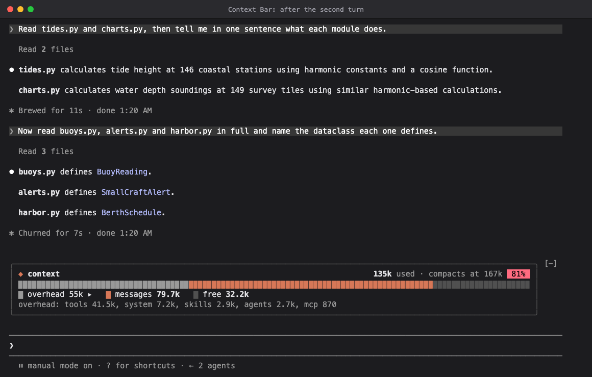

# Claude extensions

Mods, skills and plugins for [Claude Code](https://claude.com/claude-code). The repository is also a plugin marketplace, so everything in it installs with one command. Each extension has its own folder and README.

| Extension | Kind | What it does |
| --- | --- | --- |
| [context-bar](mods/context-bar/) | mod | Your context window as a meter above the prompt: the conversation, the overhead every request carries, and the room left before compaction, with a drill-down into the overhead. `/context-bar` shows or hides it. |
| [api-shots](skills/api-shots/) | skill | Runs an API test step the way your Insomnia collection would, captures the request and response as an image, with a before-and-after pair across two environments if you want one, and posts the images to an Azure DevOps work item as a captioned comment. |



## Install

From a Claude Code prompt in a terminal:

```
/plugin install context-bar --marketplace davidlambl/claude-extensions
/plugin install api-shots --marketplace davidlambl/claude-extensions
```

Answer `y` to add the marketplace, then choose a scope. Mods need Claude Code 2.1.287 or later. context-bar draws above the prompt in the terminal and the desktop app. In VS Code, which doesn't draw mod UI yet, `/context-bar` answers with the figures as text. api-shots runs scripts on your machine and needs Insomnia, PowerShell 7, Python 3 and Chrome; its README has the details.

To work on the extensions, install from a clone instead. It is read in place, so your edits reach a session on `/reload-plugins`:

```sh
git clone https://github.com/davidlambl/claude-extensions
claude plugin marketplace add ./claude-extensions
claude plugin install context-bar@davidlambl
claude plugin install api-shots@davidlambl
```

## Update

Claude Code updates plugins from this marketplace only when you ask; it auto-updates Anthropic's own marketplaces, not others, unless you turn it on. To get a new release:

```sh
claude plugin marketplace update davidlambl
claude plugin update context-bar@davidlambl
```

In a session, the same is `/plugin`, then **Installed**, the extension, **Update now**. Then run `/reload-plugins`, or start a new session.

To have releases arrive by themselves, open `/plugin`, then **Marketplaces**, `davidlambl`, **Enable auto-update**. A session then checks a few minutes after your first message, and `/reload-plugins` applies what it fetched.

Installed from a clone, the extensions are read in place: `git pull`, then `/reload-plugins`.

## Develop

Each mod is a folder under `mods/`:

```
mods/<name>/
  README.md                    what it shows, a demo, how it was built, how to run it
  screenshots/                 the demo's images, <name>-<state>.png, and the scenario that takes them
  .claude-plugin/plugin.json   manifest: name, version, description, "types"
  hooks/hooks.json             { "modules": ["./register.tsx"] }
  hooks/register.tsx           the hooks module: export const register: Register
  types/index.d.ts             the values the mod keeps in $.state
  tests/*.test.ts              run by `claude plugin test`
```

```sh
claude --plugin-dir mods/<name>      # a session with the mod loaded; it reloads on save
claude plugin validate mods/<name>   # what the engine will load, and anything it would refuse
claude plugin test mods/<name>       # the mod's tests, run against the engine itself
```

Each skill plugin is a folder under `skills/`:

```
skills/<name>/
  README.md                    what it does, a demo, how to run it, what it costs and touches
  screenshots/                 the demo's images, <name>-<state>.png, and what takes them
  .claude-plugin/plugin.json   manifest: name, version, description
  skills/<name>/SKILL.md       the skill: when Claude uses it, and how
  skills/<name>/scripts/       what the skill runs
```

```sh
claude --plugin-dir skills/<name>     # a session with the skill loaded
claude plugin validate skills/<name>  # the manifest and what the engine will load
```

List each new extension in `.claude-plugin/marketplace.json`, then `claude plugin validate .` checks the whole marketplace.

A mod's screenshots come from a real Claude Code session, driven by the scenario next to them; [`tools/screenshots`](tools/screenshots/) takes them again:

```sh
npm install --prefix tools/screenshots
node tools/screenshots/shoot.mjs mods/<name>/screenshots/scenario.json
```

api-shots takes its own screenshots with its `shoot.py`, against the environment in its `screenshots/` folder; its README has the command.
