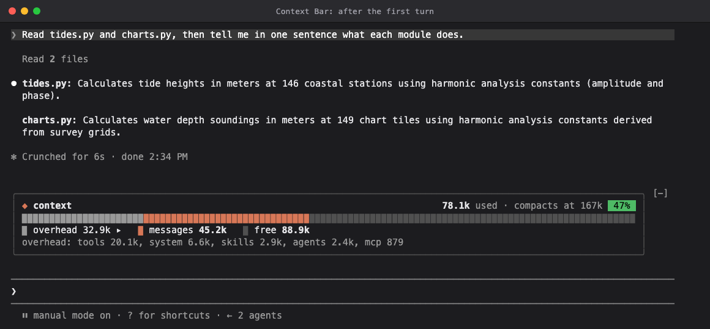
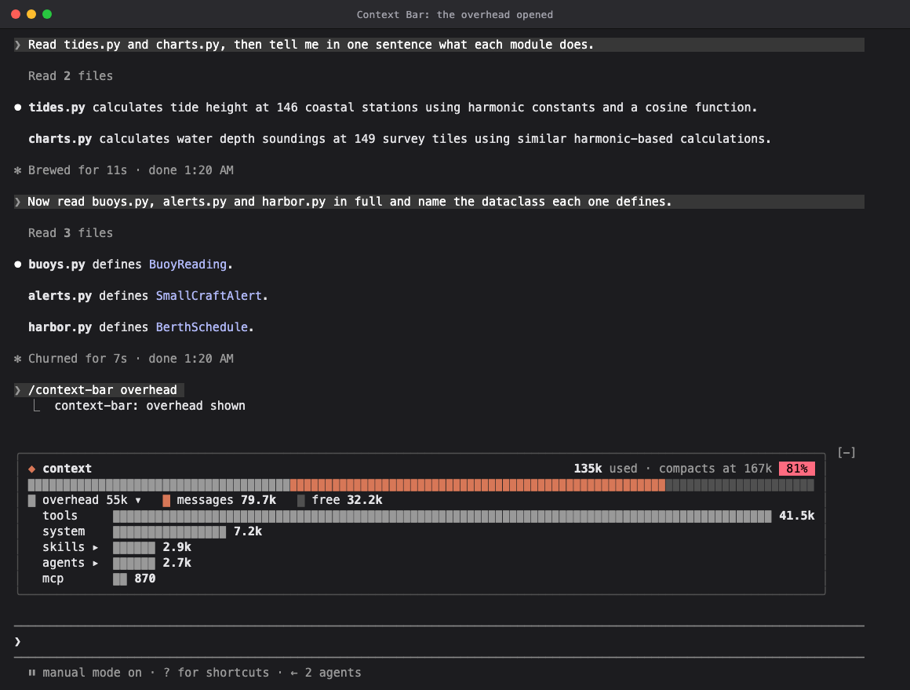
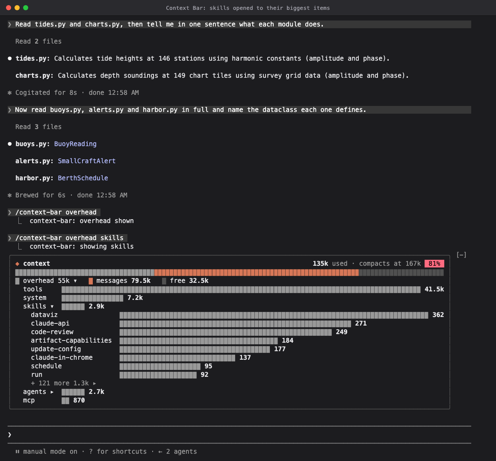

# Context Bar

A Claude Code mod that draws your context window as a meter above the prompt: the conversation, the overhead every request carries, and the room left before auto-compaction. It started as the context bar from the Claude Code newsletter, and grew a drill-down that shows what the overhead is made of.

## What this shows

Type `/context-bar` and a card appears in the band above the prompt:

- a header with the tokens in use, where auto-compaction starts, and a badge with how far along you are: green under half, yellow under 80%, red past that;
- a meter, drawn in cells, that fills toward the compaction point: the overhead in gray, the conversation (messages) in orange, and the room left as the dark track;
- a legend, and a line breaking the overhead down, largest first.

Claude Code for VS Code doesn't draw a mod's band or panes yet, so there `/context-bar` answers with the card's figures as text instead. That answer is a snapshot, counted exactly, and `/context-bar overhead <category>` adds that category's biggest items. The card also has a pane ready for surfaces without the band, which the mod API says VS Code and the mobile app will be. Once one draws mod panes, `/context-bar` opens the card in a pane there, and closing the pane turns the card off.

Press `overhead ▸` in the legend, or run `/context-bar overhead`, to open the overhead as ranked bars, one row per category. A category that lists what it is made of (mcp, skills, agents, memory files) shows `▸`: press it, or run `/context-bar overhead skills`, to see its biggest items, then `+ N more` for every item. `show fewer` folds the list back.

The figures match `/context`. After each turn the card reads Claude Code's free estimate of the window, `$.session.usage({ breakdown: 'summary' })`. That estimate takes its total from the last response, exactly, but its categories are local estimates, which in a long session ran to twice what `/context` counts. So the card counts the overhead the way `/context` does, with `breakdown: 'full'`. It counts when it first shows, and again only when the estimates show the overhead has changed, as when a tool loads. Between counts, the conversation is the total less the counted overhead.

| Hook | What it does |
|------|--------------|
| `session.start` | Registers `/context-bar`, and shows the card again if you left it on. |
| `session.attach` | Shows the card again, in its pane, when a surface without the band connects. |
| `command.run` with `{command: "context-bar"}` | Shows or hides the card, or opens the overhead and its categories. Where nothing draws, it answers with the figures. |
| `session.measure` | Measures the window again after each turn, and counts the overhead again if it changed. |
| `session.compact` and `session.end` | Measure again after a compaction, a `/clear` or a `/resume`. |
| `ui.render` with `{component: "AbovePrompt"}` | Draws the card in the band, in the terminal and the desktop app. |
| `ui.render` with `{component: "Pane"}` and `ui.close` | Draws the card in its pane where a session has no band, and turns it off when you close the pane. |

### What the overhead is

Every request Claude Code sends carries more than your conversation, and the overhead is all of it, paid again on every turn:

| Category | What it is |
| --- | --- |
| tools | The definitions of Claude Code's built-in tools: Bash, Read, Edit and the rest. |
| system | Claude Code's own instructions: how to work, how to use its tools, and details about your environment. |
| mcp | What connected MCP servers cost: the instructions they add about using their tools, and the definitions of their tools loaded into the context. With tool search, most tools load only when needed and cost nothing until then. `/context` lists the two as MCP server instructions and MCP tools. |
| skills | The list of skills Claude can use, a name and a description for each, so every plugin that brings skills adds to it. |
| agents | The descriptions of the custom agents Claude can hand work to, most of them from plugins. They are listed whether or not one ever runs; Claude Code's built-in agents are not counted. |
| memory files | CLAUDE.md files and auto-memory, loaded when the session starts. |

Messages, the rest of what is in use, is the conversation itself: your prompts, Claude's replies, tool calls and their results, and any text a hook adds, such as a plugin's start-of-session summary. It is the part that grows, and what `/compact` summarizes.

To trim the overhead, open it, see which skills and agents cost the most, and disable the plugins you are not using with `/plugin`: their skills and agents leave every request.

## Demo

After the first turn, which read two modules, 47% of the way to compaction:



After reading three more, 80%. The badge turns red as compaction nears:


`/context-bar overhead`, or pressing `overhead ▸`, opens the overhead as ranked bars:



Pressing `skills ▸` lists the skills by what they cost, with the rest one press away:



## How it was built

- **Model:** built with Claude Opus 5.5 in Claude Code. The screenshots come from a session on Claude Haiku 4.5, whose 200k window fills within a couple of turns. The mod itself doesn't call a model.
- **Prompt(s):** the build started from the prompt in the Claude Code newsletter:

  > create a mod that draws my context window as a stacked bar above the prompt, one color per category like /context, toggled with /context-bar

  Then it was steered in conversation: match the newsletter's card, use only documented theme colors, reimagine the colors with UX principles, show the cells, and let me drill into the overhead.
- **Transcript:** not shared.
- **Iterations:**
  - The first version gave every `/context` category its own color. `/context` itself reuses colors (the system prompt and the free space share one), and Claude Code lists the autocompact buffer before the free space, which the first test data hadn't. The tests now use the engine's exact rows.
  - Matching the newsletter's card used theme colors outside the mod API's documented `ThemeKey` list. They work today, but an update could change them silently, so the palette is now typed as `ThemeKey` and `tsc` refuses anything else.
  - Half-cell slices mixed block glyphs with background colors. Terminals that draw glyphs from the font, such as Apple Terminal, draw them shorter than the row, so the bar looked uneven. Every cell is now the same `▉` glyph, whose last eighth leaves a deliberate gap between cells.
  - The colors still blended. The dataviz skill's palette validator failed the per-category palette on four of five checks, and only four documented theme colors pass even on their own. So the bar became a meter with emphasis: one accent for the conversation, gray for the rest, filling toward compaction rather than the end of the window, which also dropped the reserve band.
  - The overhead became something to open: ranked bars per category, then the items inside the categories the API lists, then every item.
  - The overhead read from the free local estimates, which in a long session came to nearly twice what `/context` counted (60k against 32k). The card now counts the overhead as `/context` does, and only when it changes.
  - MCP's two categories read alike on the card, so they became one `mcp` entry. The legend's swatches are now the bar's own seven-eighths cell. As full blocks, they ran into the gap between cells and sat out of line with the bar.
  - In VS Code the card had nowhere to draw, because the extension doesn't draw mod UI yet. `/context-bar` answers with an exact snapshot there, and the card has a pane ready for when VS Code draws one.
  - Tested with `claude plugin test` (100 tests) and by breaking the code on purpose to check the tests catch it. The screenshots come from driving a real Claude Code session; [`tools/screenshots`](../../tools/screenshots/) takes them again from `screenshots/scenario.json`.

## Run it

**Requirements:**

- Claude Code 2.1.287 or later, in the terminal or the desktop app, where the card sits above the prompt. In VS Code, `/context-bar` answers with the figures as text until the extension draws mod panes. Built and tested on 2.1.290 and 2.1.291.

No environment variables or configuration.

**Steps:**

1. Install it from a Claude Code prompt in a terminal:

   ```
   /plugin install context-bar --marketplace davidlambl/claude-extensions
   ```

   Answer `y` to add the marketplace, then choose a scope.

2. Type `/context-bar`. The card stays on in later sessions until you run it again.

To try it for one session from a clone instead:

```bash
git clone https://github.com/davidlambl/claude-extensions.git
claude --plugin-dir ./claude-extensions/mods/context-bar
```

## Notes / limitations

- **The overhead is counted only when it changes.** Each count sends one token-count request per tool and memory file, as `/context` does, so the card counts when it first shows and whenever the overhead changes. A change under 2% of a category, or under 200 tokens, waits for the next count.
- **If a count fails, the card shows the estimates**, which can run well over `/context`'s figures, until the overhead changes again.
- **The card updates after each turn**, a compaction, a `/clear` and a `/resume`, not during a turn.
- **The meter fills toward compaction**, so its percentage is of the auto-compact point, not the whole window. With auto-compaction off, it fills toward the end of the window, less the small buffer `/compact` needs, so its free space and its percentage both read as `/context`'s do.
- **Only some categories open to items.** The mod API lists the parts of mcp (its instructions, and its loaded tools by server), skills, agents and memory files, but not of tools or system.
- **The short labels follow `/context`'s category names**, with MCP server instructions and MCP tools together as `mcp`. If an update renames a category, it shows under its own name, lowercased.
- **Pressing a button** needs the fullscreen terminal for a click; `/context-bar overhead [category]` works anywhere.
- **Long lists scroll inside the band**, which takes at most half the terminal's height.
- **In 16-color terminal themes**, the overhead and the free space share a gray.
- **One band per session.** Another mod that draws above the prompt competes for the same band.
- **The band and the pane each remember their own choice**, so turning the card off in VS Code leaves it on in the terminal.
- **A session that a terminal or the desktop app shows draws the band.** A phone attached to it alongside sees no card.
- **Nothing is drawn in VS Code today, in a `-p` run or under the Agent SDK.** The card never measures there on its own, whatever you left on. `/context-bar` answers with a snapshot instead.

## Dependencies

| Name | Version | License (SPDX) | Source |
| --- | --- | --- | --- |
| None | | | |

## Third-party notices

None.
