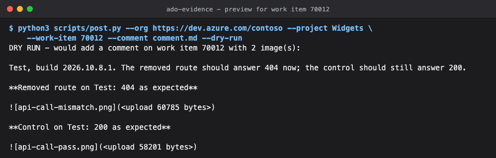

# ADO evidence

Posts images with captions as a markdown comment on an Azure DevOps work item, or revises a comment already posted, then reads it back and checks that every image rendered and matches its file. Made for test evidence from [api-call](../api-call/), but any images will do.

It comes as a skill: ask Claude to post the evidence on a work item, and it drafts the comment, previews it, and posts once you approve the text. The script also runs on its own.

## How it works

1. `post.py` uploads each image named by `{{image:file.png}}` in your markdown as a work item attachment, and puts the embedded image in its place.
2. It adds the comment in markdown, or with `--edit` replaces the text of one you already posted.
3. It reads the comment back and checks that the stored text matches, that every image renders and that each one matches the local file, and exits 1 if any check fails.

## Demo

`--dry-run` prints the comment exactly as it would be posted, with each image's size in place of the upload, and touches nothing:



The images in that sample are [api-call](../api-call/)'s own demo screenshots, which is the usual pairing: api-call produces the evidence, ado-evidence posts it. `screenshots/shoot.py` takes the image again from a clone.

## Use it

Requirements: Python 3, and the Azure CLI signed in (`az login`), or `AZURE_DEVOPS_TOKEN` holding a token for Azure DevOps.

```sh
python3 skills/ado-evidence/scripts/post.py --org https://dev.azure.com/my-org --project "My Project" \
  --work-item 123 --comment shots/comment.md --dry-run
```

`--dry-run` prints the comment as it would be posted and touches nothing. `--images DIR` names the folder the images are in, when it is not the comment's. `--edit COMMENT_ID` revises a comment instead of adding one.

A comment, with `{{image:...}}` where each image goes:

```markdown
Test, build 2026.10.8.1. 404 is the removed route; 200 is the control.

**Removed route, after: 404 as expected**

{{image:removed-after.png}}

**Control, after: 200 as expected**

{{image:control-after.png}}
```

## What it costs and touches

- **Posting acts as you.** It uploads attachments and adds or edits a comment under your Azure DevOps identity. Run with `--dry-run` first.
- **Your token goes to Azure DevOps only.** `--org` must be `https://dev.azure.com/<org>` or `https://<org>.visualstudio.com`, and an attachment is read back only from there.
- **An image is named by its file name alone**, looked up in the images folder; a path is refused.
- **Editing leaves the earlier images attached**, unreferenced; Azure DevOps keeps a comment's attachments.

## Dependencies

Python's standard library, and the Azure CLI for the token when `AZURE_DEVOPS_TOKEN` is not set.
