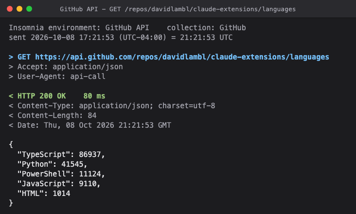
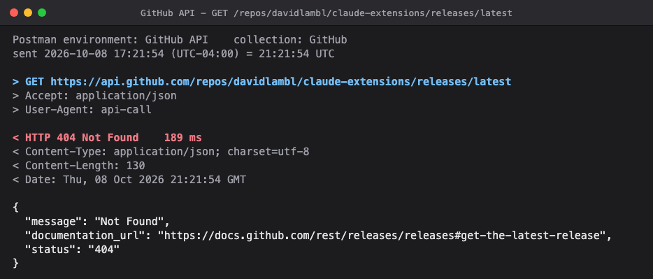

# API call

Calls an API the way your Insomnia or Postman collection would, with the collection's environment, auth and client certificate, and records the exchange as JSON with every secret masked. Ask for a screenshot and it draws the request and the response in a terminal window frame. What happens to the record and the image is up to you, or to Claude: post them on a work item, attach them to a pull request, keep them as evidence.

It comes as a skill: ask Claude to run a ticket's API test steps, to check an endpoint in an environment, or to compare one before and after a release, and it runs the calls, tells you what came back, and shows you the images. The scripts also run on their own.

## How it works

1. A source resolves the request, sends it, and prints the record. `sources/insomnia.ps1` reads Insomnia's local data (read-only): the base URL and variables from a global environment, the API key or bearer auth on the collection's top-level folder, that folder's headers, and the client certificate the collection holds for the host. `sources/postman.py` reads a Postman environment export and a collection export: their variables, and the API key, bearer or basic auth on the collection or on a top-level folder. Each keeps every secret inside its own process and refuses to print anything that would contain one.
2. `call.py` runs the source, checks the status against `--expect`, and writes the record as `<name>.json`. With `--shot`, it draws the record in the window frame and captures it with headless Chrome as `<name>.png`.
3. `render.py` is that drawing on its own: a record in, an image out. Its `frame.html` is the window frame, which [`tools/screenshots`](../../tools/screenshots/) in this repository shares.

## The record

One JSON object per call, and the interface between a source and whatever reads it:

| Field | What it holds |
| --- | --- |
| `source` | `insomnia` or `postman` |
| `environment`, `collection`, `folder` | the names resolved from; `folder` is the one whose auth was used, or null |
| `method`, `path` | `GET`, and the path as given |
| `url` | the URL as sent, with an API key in the query shown as `********` |
| `auth` | `none`, `API key in header <name>`, `API key in query parameter <name>`, `bearer token` or `basic auth as <user>` |
| `request_headers` | the headers as sent; a value that came from the auth or from a variable shows as `********` |
| `client_cert` | the client certificate's file name, or null |
| `status`, `elapsed_ms` | the response's status, and how long it took |
| `sent`, `sent_utc` | when it was sent, in local time with its offset and in UTC |
| `response_headers` | `Content-Type`, `Content-Length`, `Date` and `Location`, where present |
| `body` | the response body as text |

`call.py` adds `label`, `expected` and `verdict` (`PASS`, `FAIL` or null), and with `--shot` the image's path as `png`.

## Demo

A step through Insomnia that passed. The title carries the label and the path, the request shows the headers as sent, and the body is the response as returned, pretty-printed when it is JSON:



A step through Postman whose status did not match `--expect 200`. The image is still written, the status line is red, and the script exits 3, so the mismatch is reported as a finding rather than retaken:



Both come from `call.py` on macOS, against the GitHub REST API, with the environments in `screenshots/`: `insomnia/` is an Insomnia data folder of two files, one global environment `GitHub API` whose `baseUrl` is `https://api.github.com` and one collection `GitHub` with no auth, and `postman/` is the same as a Postman environment export and collection export. From this folder:

```sh
INSOMNIA_DATA=$PWD/screenshots/insomnia python3 skills/api-call/scripts/call.py --via insomnia --env "GitHub API" --collection GitHub \
  --expect 200 --warm --shot --out shots --name api-call-pass GET /repos/davidlambl/claude-extensions/languages

python3 skills/api-call/scripts/call.py --via postman --env "screenshots/postman/GitHub API.postman_environment.json" \
  --collection screenshots/postman/GitHub.postman_collection.json --expect 200 --shot --out shots --name api-call-mismatch \
  GET /repos/davidlambl/claude-extensions/releases/latest
```

Each writes its record and its `.html` page beside the image.

## Use it

Requirements: Python 3.11 or later; for Insomnia, the app's data on this machine and PowerShell 7 (`pwsh`); for Postman, an environment export and a collection export; for `--shot`, Chrome, Chromium or Edge (set `CHROME` if it is somewhere unusual). Built and tested on Windows and macOS; Linux is in place but untested.

```sh
# Insomnia: --env names a global environment ("Name", or "Name/Sub-environment"), --collection a collection
python3 skills/api-call/scripts/call.py --via insomnia --env "My API - Test" --collection "My API" \
  --expect 200 --warm --shot --out shots --name widget GET /api/widgets/42

# Postman: --env and --collection are the export files; --vars lays secrets kept out of the export over the environment
python3 skills/api-call/scripts/call.py --via postman --env "My API - Test.postman_environment.json" \
  --collection "My API.postman_collection.json" --vars secrets.json --expect 200 --shot --out shots --name widget GET /api/widgets/42

# A record drawn again, with a title of your own
python3 skills/api-call/scripts/render.py shots/widget.json --title "After: Test - GET /api/widgets/42"
```

| Option | What it does |
| --- | --- |
| `--expect CODE` | The status the step should return. A mismatch exits 3; the record and the image are still written. |
| `--warm` | Sends once untimed first, so a cold start does not show in the timing. |
| `--shot` | Draws the exchange and captures it as `<name>.png`, with its `.html` page beside it. |
| `--label TEXT` | Leads the image's title, such as `After: Test`; the environment's name otherwise. |
| `--folder NAME` | The collection's top-level folder that carries the auth, when more than one does. |
| `--base-url-var NAME` | The variable holding the base URL, when it is not `baseUrl`. |
| `--timeout SECONDS` | How long to wait for the response; 60 by default. |
| `--vars FILE.json` | Postman: a flat object of values laid over the environment, for secrets kept out of the export. Every value in it is treated as a secret. |
| `--cert PEM --key PEM` | Postman: a client certificate; `API_CALL_KEY_PASSPHRASE` unlocks an encrypted key. Insomnia's certificates come from the collection. |

`INSOMNIA_DATA` points at Insomnia's data folder when it is not in the usual place. Exit codes: 0 for a call that returned, 3 for a status that did not match `--expect`, 1 for anything that stopped the call.

A before-and-after pair is two runs of the same step, one per environment, each with a label: `--env "My API - Prod" --label "Before: Prod (current release)" --name removed-before`, then `--env "My API - Test" --label "After: Test (this change)" --name removed-after`.

## What it costs and touches

- **It sends real requests** to the environments you name, GET only. Pointed at production, it calls production: choose inputs that return test data, never a customer's.
- **The images show the response body as returned.** Look at each one before you share it.
- **Secrets stay in the source's process.** Keys, tokens and certificate passphrases are never printed, written or drawn; a client certificate appears by file name only, and a source refuses to print anything that would contain a secret. A folder header whose value is typed in, not templated, is not a secret to the script and is drawn as typed, so keep secrets in environment variables.
- **A redirect is recorded, never followed.** A 3xx is the response, with its `Location` header, so a key is sent only to the host the collection named.
- **It reads Insomnia's files and Postman's exports, and never writes them.** Insomnia: global environments and their sub-environments, `{{ name }}`, `{{ _.name }}` and `{{ _['name'] }}` templates, API key and bearer auth on a top-level folder, PFX and PEM client certificates. Postman: collection and environment variables, `{{name}}` templates, API key, bearer and basic auth on the collection or a top-level folder, PEM client certificates. Not supported: Nunjucks tags such as ``, Postman's dynamic variables such as `{{$guid}}` and scripts, request-level auth, Insomnia's collection environments.
- **Each image is written with its `.html` page, and each call with its `.json` record**, secrets excluded.

## Dependencies

Python's standard library. On macOS, python.org's Python has no root certificates until its `Install Certificates.command` has run; the Postman source then uses [certifi](https://pypi.org/project/certifi/) (MPL-2.0) when it is installed, and says so when it is not.
