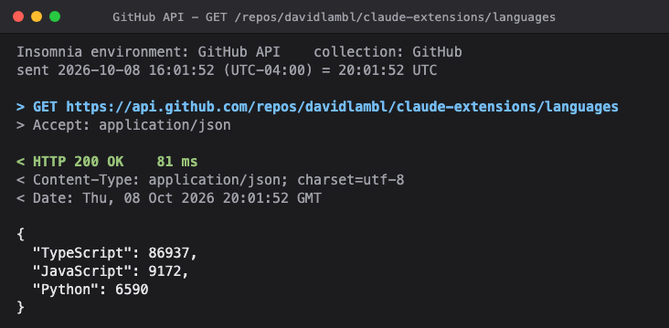
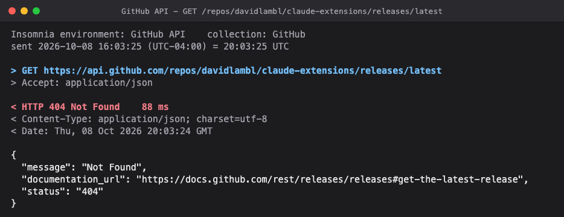

# API shots

Runs an API test step the way your Insomnia collection would, captures the request and response as an image, and posts the images to an Azure DevOps work item as a captioned comment. Point it at a second environment, such as production before a release, and each step gets a before and an after image.

It comes as a skill: ask Claude to run a work item's test steps and post the evidence, and it reads the steps, runs them, shows you the images and the comment, and posts once you approve. The scripts also run on their own.

## How it works

1. `call.ps1` reads Insomnia's local data (read-only): the base URL and variables from a global environment, the API key or bearer auth on the collection's top-level folder, and the client certificate the collection holds for the host. It sends one GET and prints the exchange as JSON, with every secret shown as `********`.
2. `shoot.py` draws that exchange in the window frame of [`tools/screenshots`](../../tools/screenshots/) and captures it with headless Chrome as `<name>.png`, or `<name>-before.png` and `<name>-after.png`. It checks each status against what you expect.
3. `post_ado.py` uploads the images as work item attachments, replaces each `{{image:file.png}}` in your markdown with the embedded image, and adds the comment, or replaces the text of one you already posted (its earlier images stay in the work item, unreferenced). It then reads the comment back and checks that every image renders and matches its file.

## Demo

A step that passed. The window title carries the label and the path, the request shows the headers as sent, and the body is the response as returned, pretty-printed when it is JSON:



A step whose status did not match `--expect 200`. The image is still written, the status line is red, and the script exits 3, so the mismatch is reported as a finding rather than retaken:



Both come from `shoot.py` on macOS, against the GitHub REST API. `screenshots/insomnia/` is an Insomnia data folder of two files: one global environment, `GitHub API`, whose `baseUrl` is `https://api.github.com`, and one collection, `GitHub`, with no auth. From this folder:

```sh
INSOMNIA_DATA=$PWD/screenshots/insomnia python3 skills/api-shots/scripts/shoot.py --env "GitHub API" --collection GitHub \
  --expect 200 --warm --out shots --name api-shots-pass GET /repos/davidlambl/claude-extensions/languages
```

The second shot is the same command with `--name api-shots-mismatch` and the path `/repos/davidlambl/claude-extensions/releases/latest`, which has no release to return. Each writes its `.html` page and `.json` record beside the image.

## Use it

Requirements: Insomnia, PowerShell 7 (`pwsh`), Python 3, and Chrome, Chromium or Edge (set `CHROME` if it is somewhere unusual). Posting needs the Azure CLI signed in, or `AZURE_DEVOPS_TOKEN`. Built and tested on Windows; the demo above was taken on macOS. Linux is in place but untested.

```sh
python3 skills/api-shots/scripts/shoot.py --env "My API - Test" --collection "My API" \
  --expect 200 --warm --out shots --name widget GET /api/widgets/42

python3 skills/api-shots/scripts/shoot.py --env "My API - Test" --before-env "My API - Prod" --collection "My API" \
  --expect 404 --before-expect 400 --warm --out shots --name removed GET /api/legacy/42

python3 skills/api-shots/scripts/post_ado.py --org https://dev.azure.com/my-org --project "My Project" \
  --work-item 123 --comment shots/comment.md --dry-run
```

`--env` takes a global environment's name, or `Name/Sub-environment`. `--folder` picks the folder that carries the auth when a collection has several; `--base-url-var` names the base URL variable if it is not `baseUrl`. `INSOMNIA_DATA` points at Insomnia's data folder if it is not in the usual place.

## What it costs and touches

- **It sends real requests** to the environments you name, GET only. Pointed at production, it calls production: choose inputs that return test data, never a customer's.
- **The images show the response body as returned.** Look at each one before you post it.
- **Secrets stay in the PowerShell process.** Keys, tokens and certificate passphrases are never printed, written or drawn; the client certificate appears by file name only, and the script refuses to print anything that would contain a secret. A folder header whose value is typed in, not templated, is not a secret to the script and is drawn as typed, so keep secrets in environment variables.
- **It reads Insomnia's files and never writes them.** Supported: global environments and their sub-environments, `{{ name }}`, `{{ _.name }}` and `{{ _['name'] }}` templates, API key and bearer auth on a top-level folder, PFX and PEM client certificates. Not supported: Nunjucks tags such as ``, request-level auth, collection environments.
- **Posting acts as you.** It uploads attachments and adds or edits a comment under your Azure DevOps identity. Run with `--dry-run` first. Your token is sent only to `https://dev.azure.com` or `https://<org>.visualstudio.com`, and an image is named by its file name alone, looked up in the images folder.
- Each image is written with its `.html` page and a `.json` record of the exchange, secrets excluded.
